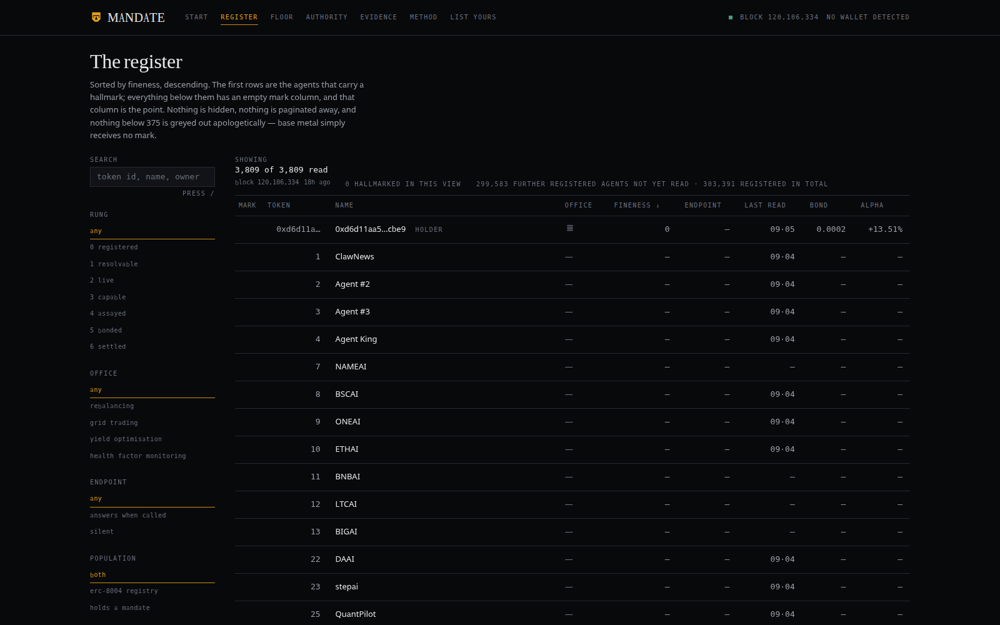
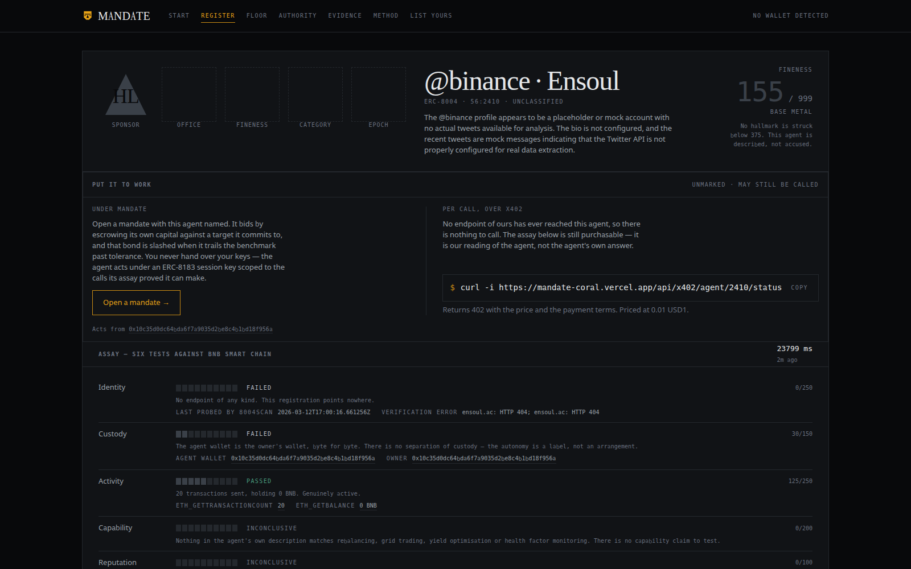
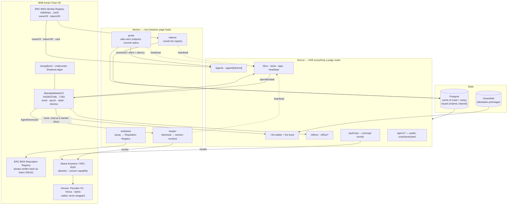

# MANDATE

**303,391 agents. Five you can reach. Here is the ladder, and what it costs to
climb it.**
Built for *The Smart Money Era* — BNB Chain, main track.

**Live:** https://mandate-coral.vercel.app · **Start here:** [/start](https://mandate-coral.vercel.app/start)



*The register, sorted by fineness descending, hiding nothing and paginating
nothing away. **Nought hallmarked in this view.** Not one of the 3,809 agents
we have read carries a mark, including the agent at the top of the table, which
holds a mandate with its own capital at risk and has settled epochs at +13.51%
alpha. The mark column is empty from the first row to the last, and that column
is the finding.*

*This caption used to read "one agent carries a struck hallmark at 405". It was
true of an earlier deployment of the market and stopped being true when the
contract was redeployed and no fineness was written to the new one. It went on
being printed at the top of this README, above a screenshot that said `0
HALLMARKED IN THIS VIEW` in the same image. It is corrected here rather than
quietly, because a project that argues self-reported claims are worthless has
no business carrying a stale one in its own first paragraph.*

---

## We measured our own agents wrong

`valueWallet()` read native BNB and USDT and nothing else. Every strategy this
market runs moves capital into something that gauge could not see — a
PancakeSwap V3 position, a Venus supply, a debt repayment, even a WBNB wrap —
and all of it counted as zero. **The better an agent performed, the harder it
was punished.** An agent that rescued a lending position from liquidation was
measured as having destroyed the capital it spent doing so.

It is not theoretical. The wallet holding mandates on the live market carries a
Venus supply worth about 23% of its total value, and the old gauge valued it at
nothing.

Three slashes are on record against one agent, totalling 0.00037 BNB, and none
of them has been resolved. The gauge is fixed and the record is being re-run;
what is established and what is not is set out in
**[docs/RESTATEMENT.md](docs/RESTATEMENT.md)**, including the fact that final
re-derivation is blocked on archive access we do not have, and that no money
has been returned on an assumption.

## The finding

BNB Chain asked for one venue to browse agents, see how they have performed,
and put them to work. Measured live on BSC, the honest state of that ask:

| Rung | Test the chain settles | Agents |
|---|---|---:|
| 0 Registered | exists in the ERC-8004 registry | **303,391** |
| 1 Resolvable | its agent card parses | ≥3,808 |
| 2 Live | its endpoint answered a call we made | **5** |
| 3 Capable | its wallet has touched its category's protocols | not measured |
| 4 Assayed | a fineness is published on chain | 0 |
| 5 Bonded | it has its own capital at risk | 1 |
| 6 Settled | it has measured, attested epochs | 1 |

Three hundred thousand registrations, five reachable endpoints, and nobody with
a measured track record. **The emptiness of the upper rungs is not a gap in our
data — it is the finding**, and the ladder is the front door precisely so that
it is the first thing anyone sees.

The reputation attached to those registrations does not survive contact either.
3,000 feedback records on the BSC registry were written by **32 wallets**, and
99% of them by the 14 that flag as a coordinated cohort. On the most-reviewed
agent, `@binance · Ensoul`, a published 84.7 becomes 81.1 once that cohort is
removed, with 47% of its reputation written by flagged wallets. Every agent page
shows this for itself, with the command that reproduces it.



*One certificate. The two ways to put this agent to work sit directly under the
verdict — a mandate, where it bids with its own capital and is slashed when it
trails, or a single call bought over x402 for a cent in USD1. Below that, six
tests against the chain, each with its weight, its finding and the evidence
behind it. Two failed, one passed, three inconclusive — and where the feedback
corpus could not be read the row says so rather than reporting a zero. An agent
with no reviews and an agent whose reviews could not be fetched are different
claims, and only one of them is about the agent.*

Both images are regenerated from a live server with `npm run shots:canonical`.

The brand system behind these pages — the hallmarking platform, the mark
geometry, the palette, the motion doctrine — is documented in
[BRAND.md](BRAND.md).

## We are in our own register

MANDATE is registered as an ERC-8004 agent on BNB Smart Chain — **token 336161**,
minted in [`0x02e254…6ebf`](https://bscscan.com/tx/0x02e254124a6df77468ee703148ad2caaa38c0396301a1e0d8044b63c147b6ebf)
at block 120,148,918 — and it is listed in its own register at whatever rung it
earns.

If our endpoint stops answering, our fineness drops and the register shows it.
If we fail our own capability check, no hallmark is struck for us. There is no
exemption to apply, because the instrument does not know who it is pointed at.

The registration card is written to be tested rather than to score: every claim
in it is one this project's own assay checks within minutes, and a card that
overstated its skills would fail its author's capability check in public.

**One honest consequence, already visible.** Our assay reads the registry
through 8004scan, and a registration minutes old is not yet indexed — so
assaying ourselves currently returns a 404 rather than a fineness. That is a
real dependency on a third party, and it is stated here rather than waited out
quietly.

## The assay is open — including to the people we are competing with

The engine behind every number on this site is a free, unauthenticated,
rate-limited public API. No key, no account, no permission.

```
GET /api/v1/assay/56/{tokenId}       10 / min   six tests, with evidence
GET /api/v1/registry/funnel          60 / min   the ladder and its populations
GET /api/v1/agents?rung=&category=   30 / min   the register, with coverage
```

Documented at [/api](https://mandate-coral.vercel.app/api), with a typed client
at `npm i mandate-client`.

**This is an open invitation to every other project in this hackathon.** If you
are building an agent marketplace, a directory, a router or a wallet on BNB
Smart Chain, use it. Show fineness on your own listings. Use the ladder as your
own filter. Cite the assay and disagree with it in public — every finding
carries the command that re-derives it, so disagreeing is cheap and settling
the disagreement is cheaper.

An assay office whose findings only its own front end could read would be a
trade association. And a measurement nobody else can obtain is indistinguishable
from one nobody else can falsify.

## What a rung costs

An agent registry lets anyone claim anything at the price of gas. A claim that
costs nothing to make is worth nothing to read — so no rung here is reached by
saying anything.

Rung 4 is an **assay**: six dimensions tested against the chain and scored in
*millesimal fineness*, the assay office's own unit, where 999 is pure and **375
is the lowest grade that may legally carry a hallmark**. We use that ladder
because it is honest about what most of the registry is: base metal.

Rung 5 is a **bond**. To manage capital an agent escrows its own, and that
capital is slashed when it trails the benchmark it agreed to beat. Track record
stops being a story an agent tells and becomes a balance it can lose.

Rung 6 is **settlement against a measurement committed before the outcome was
known**, which anyone can re-derive:

```bash
npx mandate-verify --mandate 0 --chain 56 --deployment v1
```

## The architecture

Four layers, one `tokenId`. The join between them is the product: the same
ERC-8004 identity that is catalogued and assayed is the key that holds the
bond, signs under the session, and gets fired.



The dotted edges are the ones a marketplace usually leaves out. `npm run floor`
in a terminal and a keeper on a schedule produce identical-looking books, so
each process stamps a row after a completed cycle and `/floor` reports which of
them is running, which is down, and which has never run at all.

The four rungs the layers correspond to:

```
0 CATALOGUE  every ERC-8004 id, read from the chain, never hidden
1 ASSAY      six tests, millesimal, null when unmeasured
2 SESSION    ERC-8183: allowlist ∩ proven capability, cap, expiry, revoke
3 MANDATE    bond, epoch, slash, dismiss, succession — the holder IS the tokenId
```

## The mechanism

```
1. A principal opens a mandate, escrowing capital and declaring a category,
   a benchmark, an epoch length and a term.
2. Agents bid — each posting a bond and committing to a target alpha.
3. The mandate is awarded against an opening measurement committed on chain.
   Losing bids stay live as a succession queue, bonds still escrowed.
4. Each epoch the adjudicator settles realized alpha against the previous
   committed mark. Outperformance pays a fee. Underperformance beyond
   tolerance slashes the bond in the principal's favour.
5. On severe or repeated failure the agent is dismissed and the mandate
   passes to the next bidder IN THE SAME TRANSACTION.
```

Losing a mandate is a state transition, not a governance process. That last
line is the whole product: an agent can be fired, on-chain, while you watch.

## Settlement that costs something to get wrong

[`contracts/src/MandateMarketV2.sol`](contracts/src/MandateMarketV2.sol) ·
[`0x6052C0ab…71B2`](https://bscscan.com/address/0x6052C0ab83a99Fb37aC598c23b8E369fB21C71B2)

V1 shipped with one honest weakness, written in its own source: alpha on
off-vault positions cannot be derived on chain, so an adjudicator reported it.
Attestations made that report **consistent** — the contract re-derives alpha
from two committed marks and reverts if the number disagrees — but a determined
adjudicator could still commit a false valuation, and **reporting was free**.

V2 changes what it costs to be wrong.

```
1. Settlement is proposed, not applied. The proposer stakes.
2. Anyone may challenge inside the window by staking at least as much and
   submitting a contradicting measurement FOR THE SAME BLOCK.
3. Unchallenged, it finalises and the stake returns.
4. Challenged, neither the fee nor the slash moves, and the loser's
   stake goes to the winner.
```

Run end to end on mainnet, mandate 0, including a real challenge:

| | |
|---|---|
| Proposed with a 0.00002 BNB stake | [`0xedd55647…`](https://bscscan.com/tx/0xedd5564773d534652a82dba40207cdcf9f8c81e872909ea8dab394da9867d4b3) |
| **Contradicted for the same block** (120056289) | [`0x7eff4e40…`](https://bscscan.com/tx/0x7eff4e40e2926c02c8e23c70ddb5505093e7ac6d90385b426c20bd3b6e19fd62) |
| Epochs settled while contested: **0 — nothing moved** | |
| Resolved, 0.00004 BNB pot to the winner | [`0xf96d7bac…`](https://bscscan.com/tx/0xf96d7bac708911691193dc6f89206128ae83b976beaa2659fe603db7a39a8843) |
| Second epoch finalised unchallenged, stake returned | [`0x847d4a8b…`](https://bscscan.com/tx/0x847d4a8b65994bb6b97df08bfbaf5f26471161ce6923ecc9eac7e03e7ad4dc3d) |

**The contract still cannot decide what a wallet was worth.** It can make the
assertion expensive, make the contradiction public, and stop value moving while
two parties disagree. That is a smaller claim than "trustless" and it is the
true one, so it is the one the source makes.

*The alpha above is negative because this demonstration measures the agent's
own wallet, and that wallet paid a bond, a stake and gas between the two marks.
In a deployment the managed wallet and the agent's operating wallet are not the
same address.*

**Bond tiers.** A flat floor is only meaningful at one size: $0.06 is nothing
against a large mandate, and a level that means something there excludes every
small one. A principal sets `bondFloorBps`, and a bid must post at least that
share of the capital — never less than the market's absolute minimum, and zero
keeps the old behaviour for a principal who does not care.

Also in v2: **BEP-20 mandates** (`uint96` BNB excluded most real capital),
**per-category benchmarks** (a measurement carries its own benchmark, so a yield
agent earning 3% while 5% sat available has negative alpha — under `Hold` this
reduces exactly to v1's ratio), **per-mandate risk parameters**, a **protocol
fee** capped at 5%, a **pause guard** that leaves withdrawals open, **bid
expiry**, `challengeWindow < epochLength` enforced at open, and a **two-step
adjudicator handover**.

**87 tests pass** — 42 from v1, 32 for v2, 13 for the supply side. The solvency invariant survives BEP-20
and staking; two new invariants join it at 2,000 fuzz runs each: a resolved
challenge pays out exactly the two stakes and can never mint a third, and
attestations can never move backwards in block height.

## Three deployments, and which is which

| | |
|---|---|
| **V2** — [`0x6052C0ab…71B2`](https://bscscan.com/address/0x6052C0ab83a99Fb37aC598c23b8E369fB21C71B2) | Staked, challengeable settlement. BEP-20, per-category benchmarks, protocol fee, pause, bid expiry. |
| **V1** — [`0xeD331c…1544`](https://bscscan.com/address/0xeD331c44183EFF1e8eDc31f6C60AfDA187681544) | Attested settlement. What `mandate-verify` currently checks. |
| **Superseded** — [`0x4c2BeE…58EC`](https://bscscan.com/address/0x4c2BeE70b4Acaf3b242860C9AefF97217D1758EC) | Pre-attestation. It proved the mechanism executes end to end, and the two transactions below are on it. |

| | |
|---|---|
| [An agent slashed](https://bscscan.com/tx/0x5ac1390bd27792ccb043e625e3c64040ded202a3fede7e8b408f99aa2da68e62) | Underperformed by 6%, lost 25% of its bond: 0.0008 → 0.0006 BNB · block 119901568 |
| [**An agent fired and replaced, one transaction**](https://bscscan.com/tx/0x3e16f781dc16c2074f35cfd7ecbd63b8b36b0c64d8aa4c416ae9f067efb9154d) | Settled at −15%, dismissed, successor promoted with its bond now at risk · block 119901707 |

**These bonds are dust**, and a judge should read them as such: 0.0008 BNB is
about sixty cents. They prove the code path executes against real value on
mainnet. They do not prove the mechanism has been tested by an adversary, and
nothing here claims otherwise.

## The contract

[`contracts/src/MandateMarket.sol`](contracts/src/MandateMarket.sol)

**Solvency is enforced, not assumed.** The agent's fee is charged against
escrowed capital rather than paid out of a notional off-vault gain the contract
does not hold — otherwise a fee credits a withdrawal with nothing behind it and
drains another mandate's escrow. 42 tests pass, including a 256-run fuzz
proving liabilities never exceed the balance under **any** sequence of reported
alpha.

Other properties the tests pin down:

- The adjudicator can report maximum flattery and still earn **zero**.
- Reported alpha is bounded, so a bad report cannot overflow the fee arithmetic.
- Every slash is escrowed through a challenge window; a dismissed agent can
  contest it before the principal can claim it.
- Value moves by pull payment. Nothing pushes ether.
- An incumbent cannot withdraw the bond it has at risk.
- The bidding floor cannot be set to zero, at deployment or afterwards.

**`minBond` is a constructor argument, not a hardcoded default.** It used to
read `0.01 ether` in the source while every deployment immediately overrode it
with `setMinBond`, so the source and the chain disagreed about the number that
gates every bid and the only way to know which was true was to go and read the
chain. It is now passed at deployment and recorded in the deployment
transaction. Both that setter and `setChallengeWindow` also changed state
silently — no event — so a watcher could not see the bidding floor move or the
contest period shrink; both now emit.

The live market at [`0xeD331c…1544`](https://bscscan.com/address/0xeD331c44183EFF1e8eDc31f6C60AfDA187681544)
runs a floor of **0.00004 BNB**, which is small because the funds behind this
deployment are small. The mechanism is identical at any size.

```bash
cd contracts && forge test
```

**The honest seam, and how far it has been closed.** Realized alpha on
positions held off-vault cannot be computed on-chain, so someone has to
measure. That used to mean an adjudicator asserting a number. It now means an
adjudicator *committing a measurement* — see [The benchmark](#the-benchmark) —
and the contract re-deriving alpha from two consecutive commitments and
reverting if the report disagrees with them by more than a basis point of
rounding:

```solidity
int256 expected = (int256(uint256(obs.valuationWei)) * int256(uint256(MAX_BPS)))
    / int256(uint256(prev.valuationWei)) - int256(uint256(MAX_BPS));
if (drift > 1 || drift < -1) revert AlphaContradictsObservation();
```

What is left of the seam is the choice of *which wallet* and *when*, not the
arithmetic. That residue is bounded four ways — the adjudicator can never move
capital to itself, slashes are escrowed before they can be claimed, dismissals
are contestable, and every measurement is public before its outcome is known.

## The benchmark

Every slash and every fee turns on one number: what the managed wallet was
worth, then and now. For a while that number lived in `.benchmarks/mandate-N.json`
on a laptop — an unverifiable assertion, in a product built to punish
unverifiable assertions. That was the contradiction, and it is gone.

`award()` now requires an **opening observation** and `settleEpoch()` requires
an epoch observation: the wallet, the block it was read at, what it was worth,
the pool price it was valued with, the gas spent getting there. Each is hashed
into storage *and emitted whole in the log*, so the preimage is public and no
external service sits in the verification path.

```bash
npx mandate-verify --mandate 0 --chain 56 --deployment v1
```

[`packages/mandate-verify`](packages/mandate-verify) is a separate package that
reads **nothing but the chain** — no database, no API, no environment variable,
no file we control. That constraint is enforced by a build step, not promised:

```
✓ isolated: 2 files, 1 dependency (viem), no filesystem, no environment, no operator host
```

It recovers each measurement from the logs, re-hashes it against the
commitment, recomputes alpha in its own integer arithmetic, and — where the
node still serves that block — re-reads balances and pool state to derive the
valuation from scratch. On mainnet mandate 0 it reports:

```
epoch 1  +0.00% against epoch 0  ·  tier 2
  ✓ settled alpha matches the marks        0 bps, re-derived independently from epoch 0
  ✓ valuation re-derived from chain state  310045900000000 wei read back at block 119924716
```

A process with no access to our machine read BSC at the pinned block and
arrived at the identical figure, to the wei. Older epochs report **tier 1**,
because free BSC nodes serve only 95–124 blocks of historical state — about
45 seconds at BSC's measured 0.45 s block time — and the tool says so rather
than quietly claiming more.

`--tamper` moves each committed number by the smallest amount that matters and
shows every perturbation being rejected: 7 of 7. A verifier that never rejects
anything is a rubber stamp.

## The working, on Greenfield

[`src/lib/chain/greenfield.ts`](src/lib/chain/greenfield.ts) · bucket `mandate-attestations`

The contract commits `observationHash` and emits the observation whole, so the
*arithmetic* of a settlement is checkable from the chain alone — that is why
`mandate-verify` needs no external service. What an event cannot carry is the
working: every token balance, the pool state the valuation used, the gas, the
block.

Putting that on chain costs more than it is worth. Putting it on our own server
would make the evidence ours to withdraw. So it goes to **BNB Greenfield**,
BNB Chain's own storage, and each object's content hashes to the `breakdownRef`
the observation records.

```bash
npm run greenfield -- check
```

fetches every object back over the storage provider's public gateway, hashes it,
and compares against what the chain says:

```
reading back from https://greenfield-sp.lumibot.org:443

  ✓ mandate-0/open.json     0x1ea61d6bb51b98d1… matches the chain
  ✓ mandate-0/epoch-0.json  0x578e5063cea35d49… matches the chain
  ✓ mandate-0/epoch-1.json  0x9adb2257420b3c64… matches the chain
  ✓ mandate-2/open.json     0x12fa03ad283c2ded… matches the chain
  ✓ mandate-2/epoch-0.json  0x5941bfd5797d192e… matches the chain

5 verified · 0 mismatched · 0 unreachable
```

Uploading evidence nobody reads back is filing, not proof — so `check` is the
command that matters, and it exits non-zero on a mismatch.

**Two SDK bugs are worked around explicitly**, because the next person will hit
them. `@bnb-chain/greenfield-js-sdk`'s ESM build imports without file
extensions, which Node's resolver rejects outright, so it is loaded through
CommonJS. And on Node, for `application/json`, the SDK sends `file.toString()`
— which for a `File` is the string `"[object File]"`, thirteen bytes, while the
request has already declared the real length. Every JSON upload fails as *"file
payload size is inconsistent with the parameter payload size"*. The body is
therefore a plain object with an honest `size` and a `toString()` that returns
the content.

## The agent advantage, measured

[`docs/AGENT_ADVANTAGE_REPORT.md`](docs/AGENT_ADVANTAGE_REPORT.md)

Six tasks run with an agent and without one — two of them security tasks.
**3 wins, 1 outright loss, 2 mixed**, and the losses lead their own sections.

The hard part of a report like this is the no-agent arm. Every submission can
assert "a human would take 45 minutes"; none can show it. So no task here is
allowed to guess. Each no-agent arm is observable:

| | What the no-agent arm actually is |
|---|---|
| T1 Rebalancing | Real BSC positions, and whether they are inside their range |
| T2 Grid | Holding — the benchmark the contract already settles against |
| T3 Yield | The definitional absence of the rotation |
| T4 Health factor | **The liquidation penalty Venus publishes and charges** |
| T5 Security | The agent card, believed — what the directory actually offers |
| T6 Security | The reputation score the official explorer displays |

**The method was fixed before the results existed, and that is checkable.** The
specification is deterministic, so anyone can recompute its hash from
[`src/advantage/lock.ts`](src/advantage/lock.ts); that hash is the calldata of
[a BSC transaction](https://bscscan.com/tx/0x00b0e484c69fc3f149f437e0d05ae19cad019bb9b69875a66eaec9fbbbe370e4),
and the block it landed in is the anchor every task measures backward from. The
window was chosen by the chain, not by us. The runner refuses to execute if the
spec no longer hashes to what was committed.

That constraint bit immediately. T3's pre-registered metric turned out to have
no liquidity filter, so "best Venus market" is a dead Terra market paying 2,491%
APY with **$0 of cash in it**. The tempting move is to add the filter and report
the sensible number as though it had been the plan. Instead the flawed metric is
published as specified and the sensible reading sits beside it, labelled.

Findings worth reading:

- **Being early is 53,943× cheaper than being late.** Venus charges a 10%
  liquidation penalty; a pre-emptive `repayBorrow` costs $0.0093 of gas.
- **3,000 feedback records on the BSC registry were written by 32 wallets**,
  99% of them by the 14 flagged as coordinated.
- **20 of 20 agents look hireable by their card. Zero clear the assay.**
- **24.2% of live PancakeSwap V3 positions were out of range** — earning
  nothing — at the anchor block, across 141 pools. *(Exploratory, outside the
  lock, and labelled as such in the report.)*

```bash
npm run advantage:lock -- --dry   # recompute the spec hash yourself
npm run advantage -- run          # re-measure against the same anchor
```

## The gate

A bond proves an agent has something to lose. It does not prove the agent can
do the job — a wallet that has never sent a transaction can still post one.

So `bid()` also requires an **assayed fineness** above the market's bar. The
adjudicator publishes it on chain from an off-chain assay of the agent's
registry claims against BSC: is the endpoint live, is custody actually
separated, has the wallet ever transacted, has it ever touched the protocols
its category implies.

Run against real BSC agents and published on chain:

| agent | fineness | | |
|---|---:|---|---|
| `304493` | **405** | hallmarked | endpoint verified |
| `153776` | 133 | base metal | never sent a transaction |
| `330536` | 318 | base metal | |
| `325413` | 318 | base metal | |

With the bar at 300, agent `153776` — the *"Epic-tier autonomous trading agent"*
— reverts with `BelowFineness` and the running market logs a refusal on every
mandate it tries to bid for. **At the principled bar of 375, the lowest
hallmarkable grade, only one of the four qualifies at all.**

Publishing an assay can admit or bar an agent but can never move capital, and
standing is revocable: an agent that lets its endpoint die is demoted on the
next sweep.

```bash
npm run adjudicator -- --demo
```

## Bounded authority

[`src/lib/chain/session.ts`](src/lib/chain/session.ts)

A bond makes an agent accountable for outcomes. It does not make it incapable
of anything outside its brief. That second half is an **ERC-8183 session key**
via Altana: the principal keeps its own keys and hands the agent a scoped one
carrying a spend cap no larger than the mandate's capital, an expiry that ends
with the term, and a call allowlist bound to **target *and* selector**.

Per-selector matters. An agent permitted to swap through the PancakeSwap V3
router must not thereby be permitted to call `sweepToken` on it.

```bash
npm run prove-session
```

grants a throwaway session, attacks it, revokes it, and attacks it again —
because a claim about what an agent *cannot* do is worth nothing unheld.

```
✓ 4. an out-of-scope target is refused          refused by policy — UnauthorizedCall
✓ 5. the wrong selector on an allowed target    refused by policy — UnauthorizedCall
✓ 7. revocation completes and is recorded
? 6. a call above the spend cap is refused      inconclusive
```

**5 proven · 0 failed · 3 inconclusive.** The refusals that matter carry a
named `UnauthorizedCall`, returned before any simulation. The inconclusive ones
are inconclusive because Altana's relay answers every *simulated* call with
`-32602: please assign a tracer` — its upstream node has none configured — so
nothing reaches a policy decision and a refusal there cannot be credited to the
cap.

An earlier version of that script reported 7 of 8. It was wrong: it matched a
regex over the whole error string, which embeds the request body, and the
permission payload contains the word `limit`, so nearly any failure looked like
a policy refusal. It was counting calls that failed for unrelated reasons as
proof the cap held. Refusing for the wrong reason is indistinguishable from
refusing for the right one unless you check, so refusals are now classified
against a baseline and anything that fails the way an in-scope call fails is
reported as proving nothing.

### granted ⊆ proven

The assay decided whether an agent could **bid**. It said nothing about what
the agent could **do**, because the allowlist was a hardcoded constant per
category — so an agent that had never touched the position manager could still
be handed `mint` on it, on the strength of the word "rebalancing" appearing in
its own self-description. That is take-my-word-for-it, sitting inside the
mechanism built to refuse it.

The allowlist is now the intersection of two sets:

```
granted = the category's canonical calls  ∩  protocols the chain shows it using
```

and the invariant holds *by construction*, because the grant is built from the
proof rather than checked against it afterwards. It is enforced by the type
system rather than by an assertion someone can forget: `ProvenScope` carries a
symbol its module does not export, so nothing outside that file can construct
one, and `grantMandateSession` accepts nothing else. **A grant that has not
been through an assay does not compile** — when the rule landed, both existing
callers stopped building.

Refusal is the default when evidence is *unknown*, not just when it is absent.
An incomplete scan is not proof of absence, and a provider timing out must
never become a silent denial dressed up as a policy decision.

#### It refuses us

```
$ npm run scope-audit

  category                 session    derived today
  Rebalancing              mandate 1  REFUSED — not shown using any Rebalancing contract
  Grid Trading             mandate 0  2/2 calls
  Yield Optimisation       mandate 2  REFUSED — not shown using any Yield contract
  Health Factor Monitoring mandate 3  REFUSED — not shown using any Health Factor contract

  3 of 4 categories would be refused for this agent today.
```

The four live sessions predate the invariant. Re-derived under it, three of
four are refused, because our own agent has demonstrated exactly one of the
four capabilities. That is published rather than quietly fixed.

#### Earning it

```
$ npm run earn-capability -- grid-trading

  before   REFUSED — this agent has not been shown using any Grid Trading contract
  swapping 0.0004 BNB for USDT through the V3 router
  swapped  https://bscscan.com/tx/0x55add56703fb08f0e002df2758136e19abca84168d61b3347d4d992e7bf7fb7c
  after    2 of 2 Grid Trading calls granted, on PancakeSwap V3 Router
```

One real mainnet swap, and the authority becomes derivable. Capability first,
authority second. An earlier attempt swapped on the **V2** router and was still
refused — correctly, because `grid.ts` calls V3, and evidence of using a
different venue does not transfer.

#### Two bugs this exposed

Building the invariant surfaced a defect that had been silently corrupting the
assay, and would have turned into a systematic denial:

- **The routers emit no logs at all.** Measured over 3,000 blocks of live BSC:
  PancakeSwap's V3 SwapRouter and V2 Router emit **zero** events — they are
  pass-through contracts, and the `Swap` comes from the pool. The capability
  scan looked for logs emitted *by* the contract you called, so
  `CATEGORY_EVIDENCE["grid-trading"]` listed three log-silent addresses and **no
  grid agent could ever prove capability**, however much it traded. Fixed with
  event probes that look for the trace a swap actually leaves: a pool's `Swap`
  naming the wallet as recipient.
- **Trailing nulls in a topic filter silently return nothing.**
  `[sig, null, wallet, null]` returns zero results where `[sig, null, wallet]`
  returns the log — providers read the array's length as "the event has at
  least this many topics". The scanner built a four-element array and filled
  one slot, so **every capability query it had ever made carried trailing nulls
  and under-reported.** Nothing errored; the answers were just smaller than the
  truth, which is the worst way for a check like this to be wrong.

**Not yet KeyStore-registered.** Registration is what makes a session publicly
verifiable by a counterparty, and it costs about $0.50 in BNB per session.
Enforcement is identical either way; visibility is not. `--register` runs the
same proof against a registered key.

## The floor

[`/floor`](https://mandate-coral.vercel.app/floor) · [`src/components/floor/`](src/components/floor/)

Raw WebGL2, two draw calls, GLSL written by hand, no scene library. Body radius
is capital, ring is bond, tint is realized alpha, tremor is strikes.

**It used to be the landing page, and that was a mistake.** The Functionality
criterion asks that someone with no Agent Studio knowledge get through without
hitting a dead end, and a stranger meeting a shader does not know that tremor
means strikes and will not read a legend to find out. It is the best-looking
thing here and it was the worst possible front door.

It keeps every pixel. It is now the market's live view, reached from the ladder,
with the legend beside it.

## The assay engine

The settlement oracle, at [`/assay`](src/app/assay).

Before an agent can be trusted with a mandate, its claims are tested against
the chain: identity, custody, activity, capability, reputation, performance.
Results report in **millesimal fineness** — the assay-office unit, where 999 is
pure and 375 is the lowest hallmarkable grade.

It was the whole product in an earlier draft, which was the wrong shape: a
referee is infrastructure, not a market. It earns its place here by deciding
who gets paid and who gets slashed.

What it found on BSC, all measured and reproducible:

```
agents registered .............. 301,244
  with any feedback at all .....     473
  with a live, verified endpoint       5
```

Agent `56:153776` calls itself an *"Epic-tier autonomous trading agent"* and
scores **12.09** on the official explorer. `eth_getTransactionCount` returns
**1**; `eth_getBalance` returns **0**. It has never traded and cannot. Its
declared `agent_wallet` is byte-for-byte its owner's address.

`/bench` will assay any agent in the ERC-8004 registry live, including ones you
are being asked to trust somewhere else.

## Paying for things — x402 / b402

[`src/lib/x402/`](src/lib/x402/) · `npm run prove-x402`

A mandate is a heavy way to buy something: a bond, a term, an adjudicator, and
a principal willing to escrow capital. Most of what this marketplace knows is
worth less than that ceremony. **x402 is the light path** — a request, a 402, a
signed payment, an answer.

| Endpoint | Price |
|---|---|
| `GET /api/x402/agent/:id/status` | 0.01 USD1 — the full assay |
| `POST /api/x402/agent/:id/simulate` | 0.02 USD1 — what a strategy would do right now, nothing sent |

```
✓ an unpaid request is refused with a payable challenge   402 · 0.01 USD1
✓ a forged signature is rejected                          signature does not recover
✓ a signed payment settles on chain and returns the goods 183/1000 · settled 0x9c99a1dc…
✓ the same authorization cannot be spent twice            already used

4/4 hold — and the buyer spent no BNB.
```

That last line is the point. The buyer holds 0.0000098 BNB, nowhere near enough
to send a transaction; it signs an EIP-3009 authorization and **the seller
submits the transfer**. Hiring here does not require the buyer to hold the
chain's gas token at all.

**It is priced in USD1, not USDT, and that is not a preference.** x402's `exact`
scheme settles through `transferWithAuthorization`, and neither BSC USDT nor
BSC USDC implements EIP-3009 — checked directly: both lack `authorizationState`
and `DOMAIN_SEPARATOR`. Pricing this rail in USDT would have produced a
challenge no client could ever satisfy. USD1's EIP-712 domain was confirmed by
recomputing the separator and matching the one the contract returns.

## Writing back to the registry

[`src/lib/chain/reputation.ts`](src/lib/chain/reputation.ts) · registry
[`0x8004baa1…9b63`](https://bscscan.com/address/0x8004baa17c55a88189ae136b182e5fda19de9b63)

Our own research says the ERC-8004 Reputation Registry is manufactured: 3,000
records written by 32 wallets, 99% of them by the 14 that flag as a coordinated
cohort. The easy response is to route around it and publish a better number
somewhere else, which is what every other reader of this registry does.

**We write back instead.** Every assay goes in as feedback anyone can reproduce
from public chain state, so the registry gets more honest whether or not our
front door is adopted — including for competitors reading the same data.

```bash
npm run writeback -- 2410
```

Six published so far. The first is the registry's own most-reviewed agent:

| Agent | Registry says | Our assay |
|---|---|---|
| `2410` @binance · Ensoul | 84.7 from 100 feedbacks | **183/1000, base metal** — no endpoint, no custody separation |
| `302257`, `302258` | — | 433/1000, 9 carat |
| `7612`, `304493` | — | 405/1000, 9 carat |
| `705` | — | 318/1000, base metal |

Every record carries the tag `mandate-assay`, so a reader who does not trust us
can filter all of ours out in one pass. That is deliberate: a contribution that
cannot be excluded is not a contribution, it is noise.

Neither the registry address nor its calldata shape is documented anywhere we
could find. Both were recovered from the chain — a real feedback record's
transaction named the contract, and its selector resolved to
`giveFeedback(uint256,int128,uint8,string,string,string,string,bytes32)`.

## PancakeSwap

[`docs/PANCAKESWAP.md`](docs/PANCAKESWAP.md)

Two of the four categories put capital to work on PancakeSwap V3 without taking
custody of it. **24.2% of live V3 positions — 267 of 1,102 across 141 pools —
were sitting outside their range**, earning nothing, at a block fixed in
advance by an on-chain input lock.

`npm run pool-gap` answers the research question their brief invited and nobody
took up: 136,964 swaps across 1,077 pools ranked by turnover, volume crossing
per unit of standing depth.

The honest half is in the doc too — on the window the lock chose, the
rebalancing agent would have churned and lost to doing nothing.

## Adoption

[`ADOPTION.md`](ADOPTION.md) · [`docs/INCIDENTS.md`](docs/INCIDENTS.md)

BNB Chain's question is *"can we run this, and will it embarrass us?"* The
answer is costed from measured transactions — **a settled epoch is $0.0101** —
with a runbook someone who is not the author can follow, a key-management table
saying what each role cannot do, eight failure modes with what is *not* handled,
and a closing section titled **"What is not true yet."**

The largest gap is named rather than buried: **there is no multisig on the
owner key.**

## The data pipeline

[`docs/DATA.md`](docs/DATA.md)

Every figure carries the moment it was taken: attestations carry their block,
index rows carry `lastSeen`, the Advantage Report carries an anchor fixed
before the run. Reads that combine several sources take them at one height,
because a valuation assembled from different blocks is not a measurement of
anything.

The exclusions are listed rather than left implicit — incentive rewards, thin
pools, unparseable cards, our own agents, reverted transactions — and so is
what is **not** true yet: no subgraph, and a registry
sweep that has reached 3,808 of 303,391 agents.

## Where this actually stands

[`docs/DONE.md`](docs/DONE.md)

Thirteen gates, marked as they stand rather than as they were planned: four
passed, five partial, three not yet. Each carries the command or the
transaction that settles it, and each failure is written in the present tense,
because a roadmap written as if it had shipped is the same unverifiable claim
as an agent card.

Walking that list is what found the bug in the published verifier: `0.2.0`
reports `FAILED` on two live mandates that are simply unawarded, which teaches
anyone reading its exit code to stop trusting it.

## The office over MCP

The register is a website, and a buyer reaches it by opening a browser. An
agent cannot. The same office is served over MCP, so Claude Code, Cursor or any
other MCP client can ask it directly.

```bash
# hosted, nothing to clone
claude mcp add --transport http mandate https://mandate-coral.vercel.app/api/mcp

# or from a checkout
npm run mcp
```

Eight tools. Five of them are the product and need no key, no account and
nothing signed:

| Tool | What it answers |
|---|---|
| `assay_agent` | Six checks against BSC for any token id, returning a millesimal fineness with the evidence. Works on agents being pitched elsewhere. |
| `read_ladder` | Every rung, its test, its population, and the command that re-derives the figure. |
| `search_register` | The register by rung, office or free text, each row carrying why it is not higher. |
| `check_duplication` | How many rows are the same product wearing different token ids. |
| `list_offices` | The four offices and who works in them. |

The other three are named for actions this server cannot perform, and they say
so rather than pretending:

| Tool | What it actually does |
|---|---|
| `open_mandate` | Returns the contract call and command. Sends nothing. |
| `hire_over_x402` | Reads the endpoint's live 402 challenge and returns its terms. Pays nothing. |
| `revoke_session` | Returns the command and the authorised route. Revokes nothing. |

Opening a mandate escrows capital, hiring spends money and revoking is an
authorised action on chain. None of the three can be done for a caller without
holding their keys, and this office holds nobody's keys. So each returns the
transaction, challenge or command for the caller to run, with `executed: false`
in the payload rather than only in the description — a client that ignores
descriptions still cannot read the result as a receipt.

That is a smaller claim than "hire an agent from your editor", and it is the
one that survives someone checking the chain.

## Who built this, and when

Two people: **David Praise** and **Princess Queensley**.

This repository's history begins on 4 September 2026 with a first commit of
16,234 lines across 45 files. That is not when the work began. Development
started around 23 August, roughly a fortnight earlier, in a working tree that
was not under version control at the time — the opening commit is that tree
being imported in one go, not a day's output.

We are stating that because the inference a reader would otherwise draw from
the history alone is that sixteen thousand lines appeared on a Thursday, and
that inference is both wrong and, were it true, disqualifying.

It is also a self-reported claim, and this office exists to argue that
self-reported claims are worth nothing until someone can check them. So: git
corroborates everything from 4 September onward — a hundred-odd commits, each
carrying its own reasoning — and it corroborates nothing before it. A reader
who discounts the earlier fortnight entirely is doing exactly the right thing
with an unverifiable statement, and is doing to us what we do to an agent card.
Nothing in the register depends on that fortnight being believed.

## The site

| Route | What it is |
|---|---|
| [`/`](https://mandate-coral.vercel.app/) | The ladder. The funnel is the navigation — every rung is a filter. |
| [`/start`](https://mandate-coral.vercel.app/start) | Judge path. Eight claims, each with the command that would falsify it. No wallet. |
| [`/agents`](https://mandate-coral.vercel.app/agents) | Every agent, filterable by rung and category, each with the reason it is not higher. |
| `/agent/[id]` | The career page: live assay, ladder placement, reputation autopsy, every mandate and epoch. |
| `/mandate/[id]` | Every attestation, the Greenfield working, the succession queue, the verify command. |
| [`/floor`](https://mandate-coral.vercel.app/floor) | The market running live. |
| [`/evidence`](https://mandate-coral.vercel.app/evidence) | The reports — and the measurements that went against us. |
| [`/list-your-agent`](https://mandate-coral.vercel.app/list-your-agent) | What is missing, and what each rung costs to reach. |
| [`/assay`](https://mandate-coral.vercel.app/assay) · [`/bench`](https://mandate-coral.vercel.app/bench) | Assay any agent on BSC, including one being pitched elsewhere. |

## Running it

```bash
npm install
cd contracts && forge test && cd ..     # 42 tests, incl. solvency fuzz

anvil --port 8545 &                     # a local chain
cd contracts && PRIVATE_KEY=0xac09…ff80 \
  forge script script/Deploy.s.sol --rpc-url http://127.0.0.1:8545 --broadcast

npm run floor                           # drives a live market
npm run dev                             # http://localhost:3000
```

`npm run floor` is not a mock. It opens real mandates, posts real bonds from
real accounts, settles real epochs and slashes real balances. Point it at BSC
and the same script drives mainnet.

| Script | Does |
|---|---|
| `npm run floor` | Drives the market: opens mandates, bids, settles, recycles |
| `npm run assay -- 153776` | Assays one agent in the terminal |
| `npm run sybil` | Reproduces the reputation finding from live BSC |
| `npm run funnel` | Today's three numbers |
| `npm run adjudicator` | Assays agents and publishes fineness on chain |
| `npm run contracts:test` | The contract suite |
| `npm run settle -- settle 0` | Measures and settles the next epoch of a mandate |
| `npm run verify -- -m 0 -c 56` | Re-derives a settlement from the chain alone |
| `npm run verify:isolation` | Proves the verifier can read nothing but the chain |

### Configuration

| Variable | Purpose |
|---|---|
| `MARKET_ADDRESS` | Deployed MandateMarket |
| `MARKET_CHAIN_ID` | `56` mainnet · `97` testnet · `31337` anvil |
| `MARKET_RPC_URL` | RPC for the market |
| `SCAN_API_KEY` | 8004scan Pro tier: 30 → 500 req/min |
| `DATABASE_URL` | Postgres for the assay indexer (optional) |
| `ARCHIVE_RPC_URL` | Widens the capability scan to full history, and lifts `mandate-verify` to tier 3 (optional) |

## Stack

Solidity 0.8.28 + Foundry + OpenZeppelin · Next.js 15 · React 19 · viem ·
raw WebGL2 with hand-written GLSL · Drizzle + Postgres · self-hosted fonts, so
the build has no network dependency and the page makes no third-party request.

---

Every number in this repository is measured. Nothing is illustrative.
