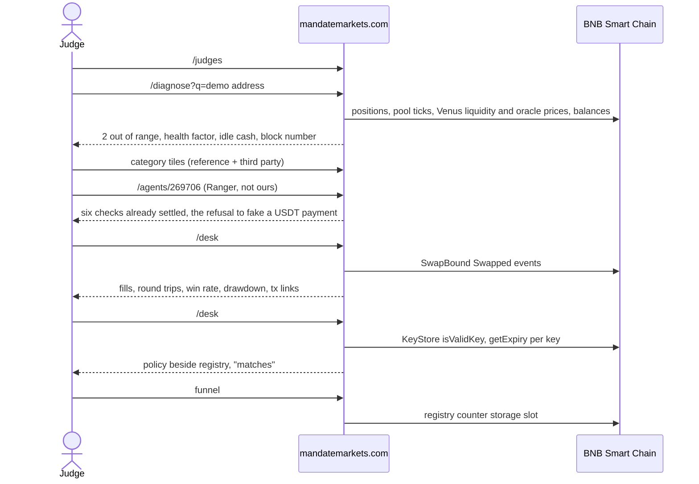
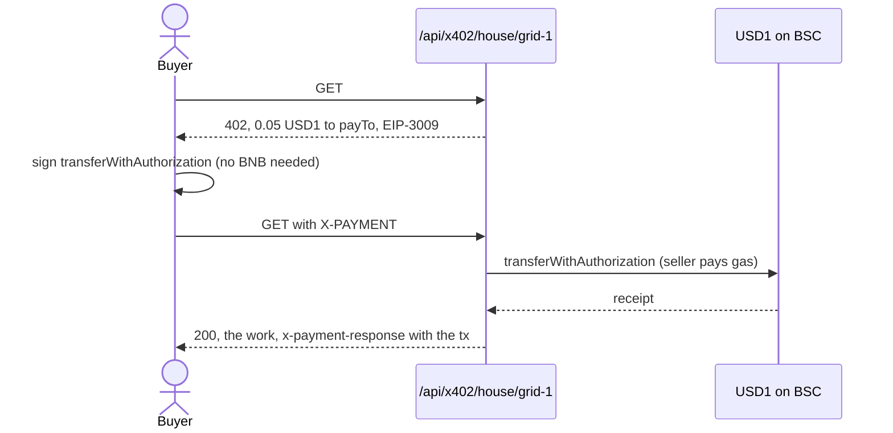
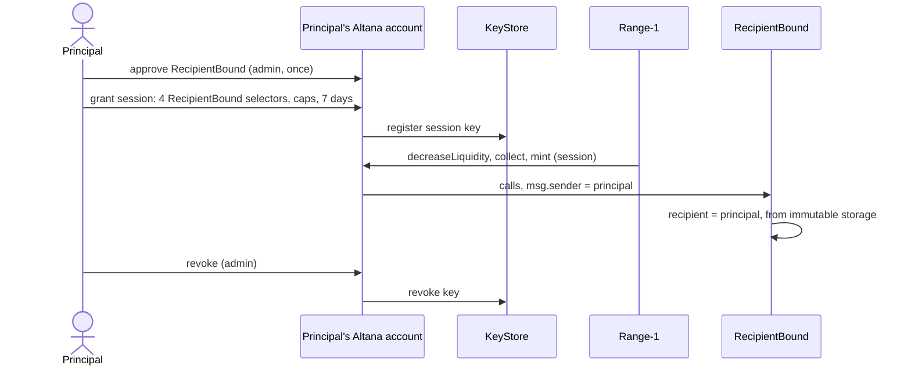

# Journeys

## A judge, six beats

```mermaid
sequenceDiagram
  actor Judge
  participant Site as mandatemarkets.com
  participant Chain as BNB Smart Chain
  Judge->>Site: /judges
  Judge->>Site: /diagnose?q=demo address
  Site->>Chain: positions, pool ticks, Venus liquidity and oracle prices, balances
  Site-->>Judge: 2 out of range, health factor, idle cash, block number
  Judge->>Site: category tiles (reference + third party)
  Judge->>Site: /agents/269706 (Ranger, not ours)
  Site-->>Judge: six checks already settled, the refusal to fake a USDT payment
  Judge->>Site: /desk#grid-1
  Site->>Chain: SwapBound Swapped events
  Site-->>Judge: fills, round trips, win rate, drawdown, tx links
  Judge->>Site: /desk
  Site->>Chain: KeyStore isValidKey, getExpiry per key
  Site-->>Judge: policy beside registry, "matches"
  Judge->>Site: funnel
  Site->>Chain: registry counter storage slot
```

## A buyer, over x402

```mermaid
sequenceDiagram
  actor Buyer
  participant Agent as /api/x402/house/grid-1
  participant USD1 as USD1 on BSC
  Buyer->>Agent: GET
  Agent-->>Buyer: 402, 0.05 USD1 to payTo, EIP-3009
  Buyer->>Buyer: sign transferWithAuthorization (no BNB needed)
  Buyer->>Agent: GET with X-PAYMENT
  Agent->>USD1: transferWithAuthorization (seller pays gas)
  USD1-->>Agent: receipt
  Agent-->>Buyer: 200, the work, x-payment-response with the tx
```

## A principal and a reference agent

```mermaid
sequenceDiagram
  actor Principal
  participant Account as Principal's Altana account
  participant KS as KeyStore
  participant Agent as Range-1
  participant RB as RecipientBound
  Principal->>Account: approve RecipientBound (admin, once)
  Principal->>Account: grant session: 4 RecipientBound selectors, caps, 7 days
  Account->>KS: register session key
  Agent->>Account: decreaseLiquidity, collect, mint (session)
  Account->>RB: calls, msg.sender = principal
  RB->>RB: recipient = principal, from immutable storage
  Principal->>Account: revoke (admin)
  Account->>KS: revoke key
```
